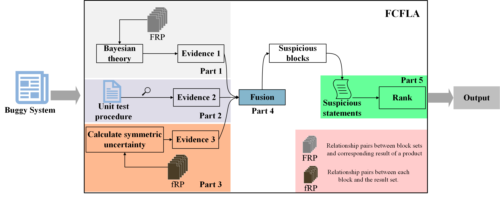

# FCFLA

## A Fast Fault Localization Approach Based on Block-Level Uncertainty Inference for Software Product Lines

###Overview

### Abstract
Fault localization for software product lines (SPLs) is complex and difficult. 
Developing an algorithm that is both high-performing and efficient is challenging. 
In this paper, we propose an approach named FCFLA, which addresses the above challenge better than existing approaches.
For efficiency, a block-level buggy statement examination is being applied for the first time to the fault localization in SPLs. 
Due to the uncertainty in this examination process, uncertainty inference methods, i.e., Bayesian decision theory and Dempster-Shafer (D-S) evidence theory, are used to detect suspicious blocks. 
Further, to improve the performance of the algorithm, the suspicious statement ranking is comprehensively determined based on the suspiciousness of the block it belongs to and its suspiciousness based on the program spectrum.
Four state-of-the-art approaches (STOAs) are compared with FCFLA on six publicly available SPL systems.
In the single-bug cases, FCFLA can rank the buggy statements to the top-1 positions in 41% of the cases and to the top-4 position in 83% of the cases. 
For efficiency, FCFLA runs 10-17 times faster than its competitors for small systems (with 8-13 features) and 661 times faster for a relatively large system with 27 features. 
In the multiple bugs, the buggy statements of the 12% cases can be ranked to the top-1 positions by FCFLA, comparable to SOTAs.
In a nutshell, our approach is high-performing and efficient, providing a promising alternative for fault localization in SPLs.

This project references [VarCop](https://ttrangnguyen.github.io/VARCOP/) in its code.
And FCFLA has less dependency on the platform and libraries used, both Linux and Windows systems can use it normally.
The meaning of arguments are as following:
1. **system_name**: For example Email, GPL, or ZipMe, etc
2. **buggy_systems_folder**: the path of the folder where you place the buggy versions of the systems, e.g. /Users/thu-trangnguyen/SPLSystems/Email/1Bug/4wise/
3. **sbfl_metrics**: The list of spectrum-based fault localization metrics that you would like to use for calculating suspiciousness scores of the statements
4. **w**: the weight (from 0 to 1) used to combine product-based suspiciousness score and test case-based suspiciousness score. The default value is 0.5.

### How to run FCFLA?
You can download the full version of data we used at [here](https://tuanngokien.github.io/splc2021/).
Set the corresponding system_name and buggy_systems_folder in Main_BuggyStatements_Ranking.py to run it directly.

### Aggregating the average ranking result of FCFLA, SBFL, S-SBFL, and FB
In order to aggregate the ranking results of the approaches, you can simply configure the appropriate arguments in the file Main_ExperimentalResultAnalysis.py and then execute it.

The meaning of arguments are as following:
1. **experimental_dirs**: The path of excel files containing ranking results that you want to aggregate
2. **num_of_examed_stms**: The number of statements that developers will investigate before giving up. This use to evaluate Hit@X, PBL. The default value is 10.

